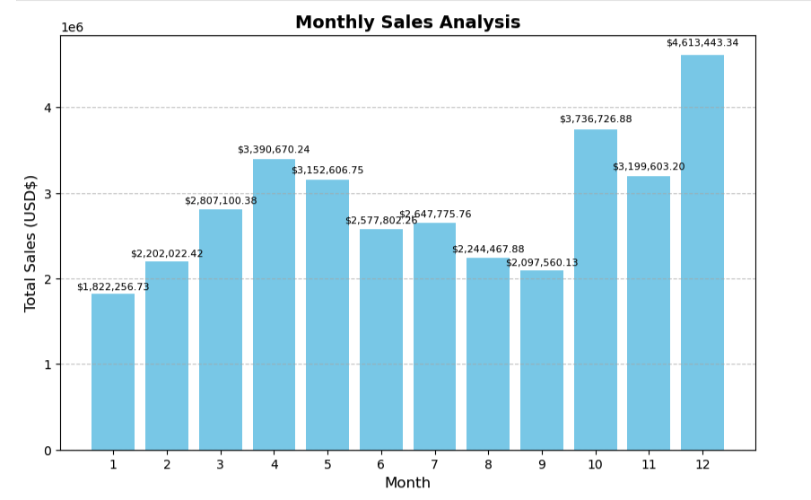
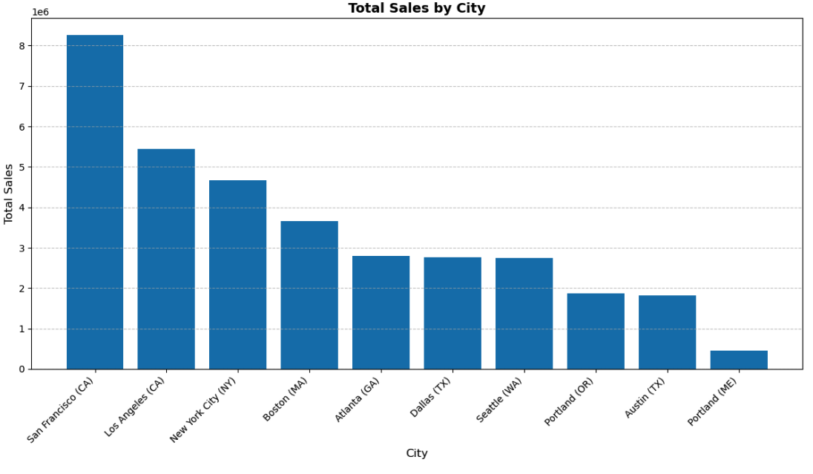
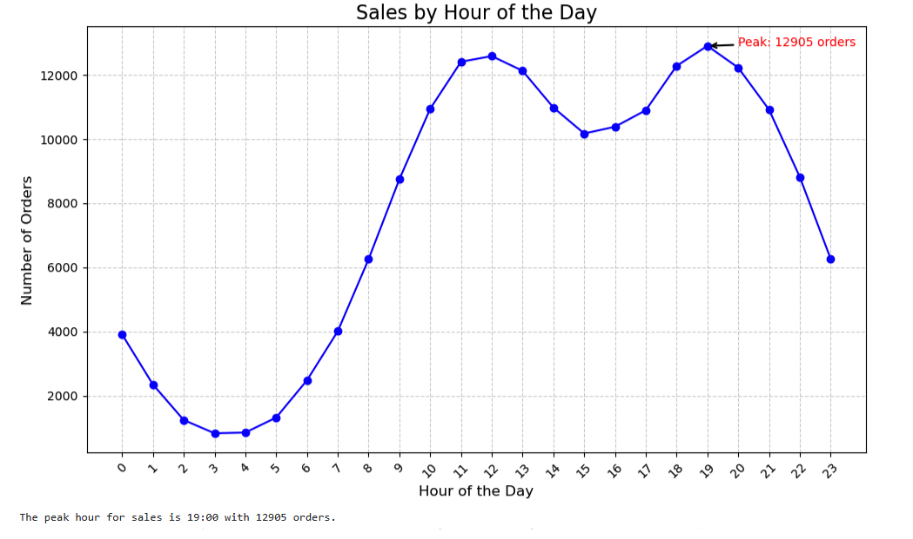

# Electronics Store Sales Data Analysis

## Project Overview
An exploratory data analysis of a full year of U.S. electronics store sales transactions (~186K orders across 12 monthly CSV files), aimed at answering four core business questions: which months drive the most revenue, which cities sell the most, when customers are most likely to buy, and which products sell best. Built end-to-end in Python — from raw file merging and cleaning through to visualized, actionable insights.

## Business Questions
1. Which month recorded the highest sales, and what was the total revenue by month?
2. What are the monthly trends in sales quantity vs. total sales amount?
3. Which city sold the most product?
4. What time should ads be displayed to maximize the likelihood of a purchase?
5. Which product sold the most, and how does quantity relate to price?

## Key Findings
- **December was the top month**, with **$4.61M** in sales — nearly 2.5x January's total ($1.82M) — likely holiday-driven demand.
- **San Francisco (CA) is the top-selling city**, contributing **24% of total sales**, followed by Los Angeles (15.8%) and New York City (13.5%). These three metro markets generate over half of all revenue.
- **7 PM is the peak ordering hour** (12,905 orders), with a secondary peak around 12 PM — suggesting ads perform best in early evening and midday windows.
- **AAA and AA Batteries were the top sellers by volume** (31K and 27.6K units), while high-ticket items like MacBooks and iPhones drove revenue despite lower unit counts — a classic volume-vs-value tradeoff visible in the dual-axis quantity/price chart.

## Methodology
1. **Data Consolidation** — Merged 12 monthly CSV files into a single unified dataset using `os` and `pandas`.
2. **Data Cleaning & Formatting** — Handled missing rows, converted `Order Date` to datetime, and cast numeric columns to the correct types.
3. **Feature Engineering** — Derived `Month`, `City`, `Sales` (Quantity × Price), `Hour`, and `Minute` columns from raw fields.
4. **Exploratory Analysis** — Grouped and aggregated data by month, city, hour, and product to answer each business question.
5. **Visualization** — Built static charts (Matplotlib) and an interactive chart (Plotly Express) to communicate trends clearly.

## Tools & Libraries
- **Python** — pandas, os
- **Visualization** — Matplotlib, Plotly Express
- **Environment** — Jupyter Notebook

## 📁 Repository Structure
```
Electronic-Store-Sales-Data-Analysis/
├── notebooks/
│   └── Electronic_Store_Sales_Analysis.ipynb   # Full analysis notebook
├── data/                                        # (optional) raw monthly CSVs or link to source
├── images/                                      # Exported chart screenshots for README
└── README.md
```

## Sample Visuals
*(Add exported PNG screenshots of your key charts here once uploaded — e.g. Monthly Sales, Sales by City, Sales by Hour, Quantity vs. Price)*

```markdown



```

## Business Value
These findings can directly inform:
- **Inventory planning** — stock up ahead of Q4/December demand surge
- **Marketing spend** — prioritize San Francisco, LA, and NYC markets; time ad campaigns around the 7 PM (and secondary 12 PM) order peak
- **Bundling strategy** — pair high-volume, low-cost accessories (batteries, cables) with high-value electronics to lift average order value

## Author
Data Analytics Portfolio Project — demonstrating data cleaning, feature engineering, exploratory data analysis, and data visualization in Python.
